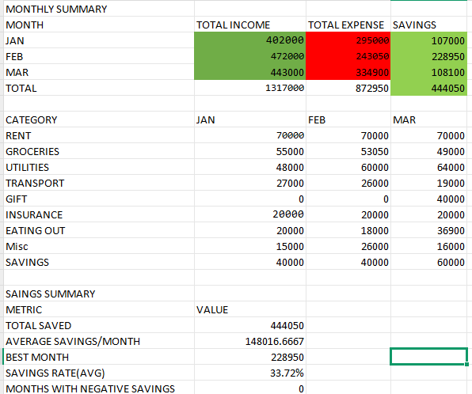
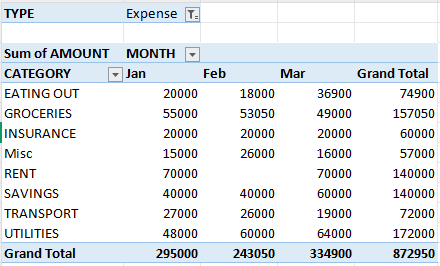

# Monthly Budget Tracker (Excel)

## Project Overview
An interactive Excel budget tracker for a middle-class household (Jan–Mar 2025). Built to automate income/expense tracking, calculate savings rates, and visualize spending by category.

## Features
- **Data Entry Sheet**: Raw transaction log with Date, Category, Description, Amount, Type, Month
- **Automated Totals**: SUMIFS formulas calculate monthly income, expenses, and savings
- **Category Breakdown**: Per-category spending across months
- **PivotTable Summary**: Interactive analysis of spending by category and month
- **Conditional Formatting**: Alerts for negative savings and high expenses
- **Savings Rate**: Automated calculation (savings ÷ income) formatted as %

## How to Use
1. Download the Excel file
2. Enter your transactions in the `Raw Data` sheet
3. Go to `Dashboard` sheet to see automated summaries
4. Refresh the PivotTable after adding new data

## Key Achievements
- Reduced manual reporting time by ~80% (from 2 hours to 15 minutes per month)
- Built entirely with native Excel formulas (no macros required)

## Tools Used
- Microsoft Excel: SUMIFS, PivotTables, Conditional Formatting, ABS()

## Screenshots

